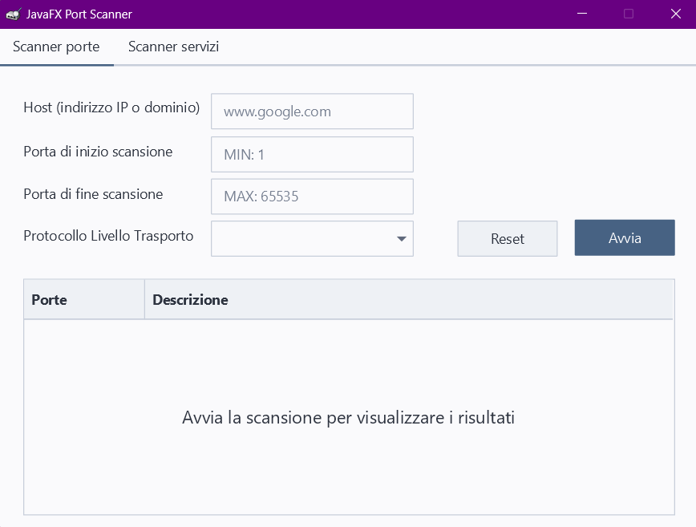
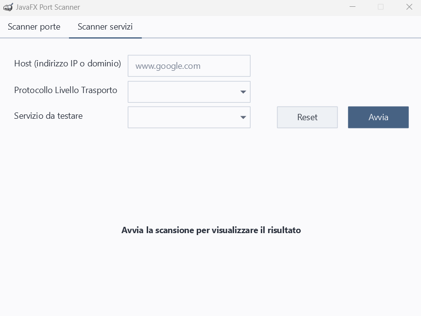

<h1 align="center">JavaFXPortScanner</h1>

<p align="center" style="font-family: monospace">Made by <a href="https://github.com/matbagnoletti">@matbagnoletti</a></p>
<p align="center" style="font-family: monospace">Docenti: prof.ssa <a href="https://github.com/mciuchetti">@mciuchetti</a> e prof.ssa Fioroni</p>
<p align="center" style="font-family: monospace">Corso TPSIT a.s. 2023/2024, <a href="https://www.avoltapg.edu.it/">ITTS A. Volta (PG)</a></p>
<p align="center">
    
    
</p>

## Descrizione
Applicazione JavaFX che, mediante un'interfaccia grafica, permette di scansionare le porte di un dato host ricercando servizi TCP e UDP disponibili.

## Requisiti
- [JDK](https://www.oracle.com/it/java/technologies/downloads/) (v8 o superiore)
- [JavaFX SDK](https://gluonhq.com/products/javafx/) (v22)
- [Gradle](https://gradle.org/install/) (v8.6)

È possibile visualizzare le versioni già presenti sul proprio dispositivo mediante i seguenti comandi:
```
java -version
gradle -v
```

## Installazione e utilizzo
1. Scaricare il file compresso del progetto
2. Estrarre il progetto
3. Eseguire l'applicazione:
    - Tramite IDE
    - Tramite terminale:
        1. Naviga nella root del progetto
        2. Esegui la build del progetto: `gradle build`
        3. Identifica il file `jar` nella directory `/build/libs/`
        4. Esegui il comando: `java --module-path /path/to/javafx/lib --add-modules javafx.controls,javafx.fxml,javafx.web,javafx.swing -jar build/libs/<nome-del-file-jar>.jar`

## Struttura e funzionamento
Il progetto si compone da quattro classi:

- Nel package `tpsit.javaportscanner.javafxportscanner`:
   - [`App`](src/main/java/tpsit/javaportscanner/javafxportscanner/App.java), l'applicazione JavaFX
   - [`Controller`](src/main/java/tpsit/javaportscanner/javafxportscanner/Controller.java), la classe di controllo e iterazione di JavaFX
   - [`PortScanner`](src/main/java/tpsit/javaportscanner/javafxportscanner/PortScanner.java), la classe principale del programma, che si occupa dello scanning
   - [`Risultato`](src/main/java/tpsit/javaportscanner/javafxportscanner/Risultato.java), una classe che viene utilizzata da JavaFX per l'inserimento dei dati dei risultati nell'interfaccia grafica di JavaFX
     
L'applicazione permette all'utente di:
1. **Scanner Porte**: effettuare uno scanning delle porte di un dato host in un range, specificando il protocollo di livello di trasporto utilizzato (TCP o UDP).
   <p align="center">
      
   </p> 
2. **Scanner Servizi**: effettuare uno scanning specifico di host per verificare se un dato servizio è disponibile o meno.
   <p align="center">
      
   </p> 

## Licenza d'uso
Questo progetto (e tutte le sue versioni) sono rilasciate sotto la [MB General Copyleft License](LICENSE).